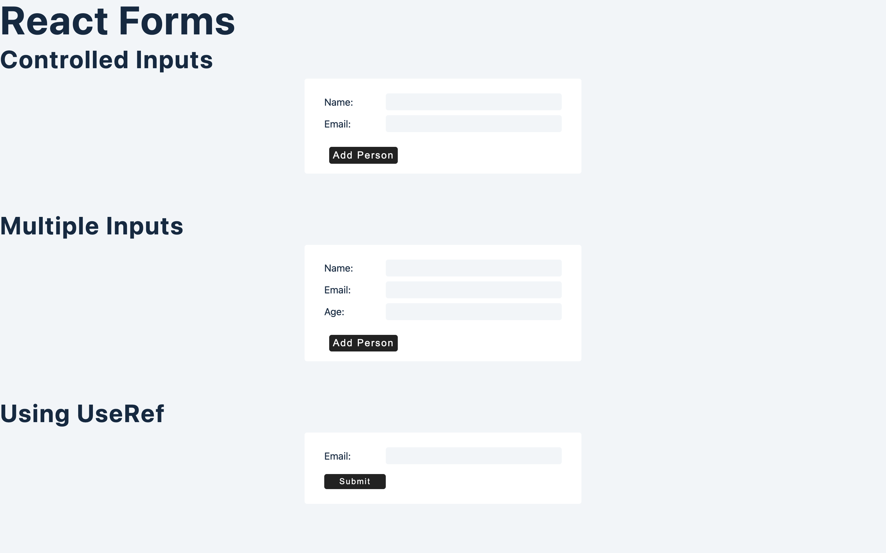

# Form management using React

In this project, we refer how to manage *forms* and get their values using **useState Hook**

We also look into the basics of **useRef Hook**

Deployment Link will soon be provided.
