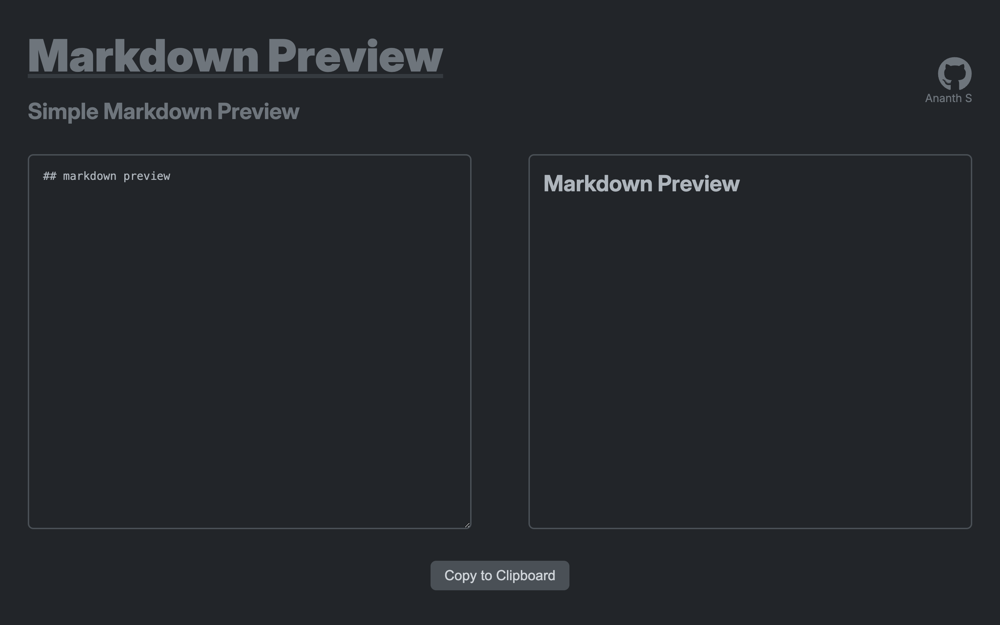

# Markdown Preview 

This project shows how to make a simple textarea for input in markdown and shows how to convert it to Preview for markdown.
It uses *React-Markdown*.

[Click here for Implementation](https://wda-react-projects-13-markdown.netlify.app/)
