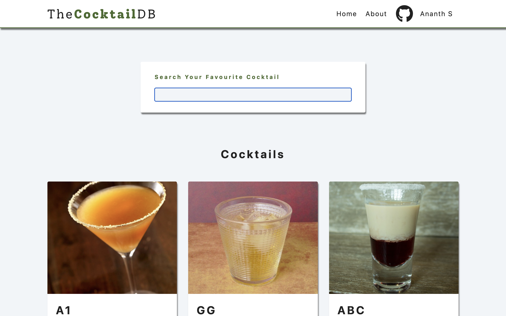
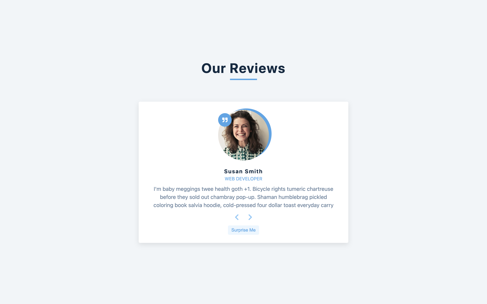
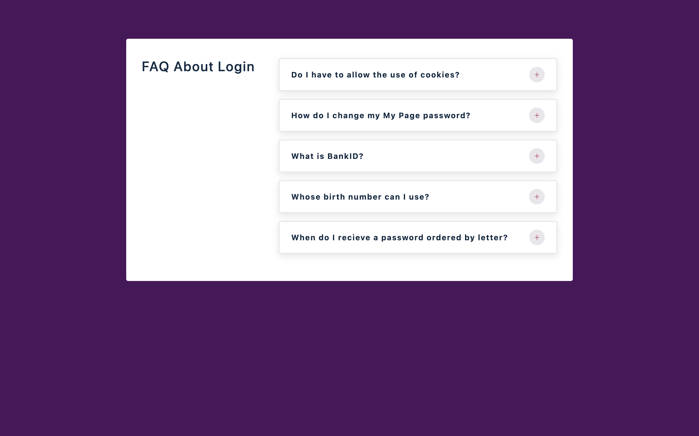
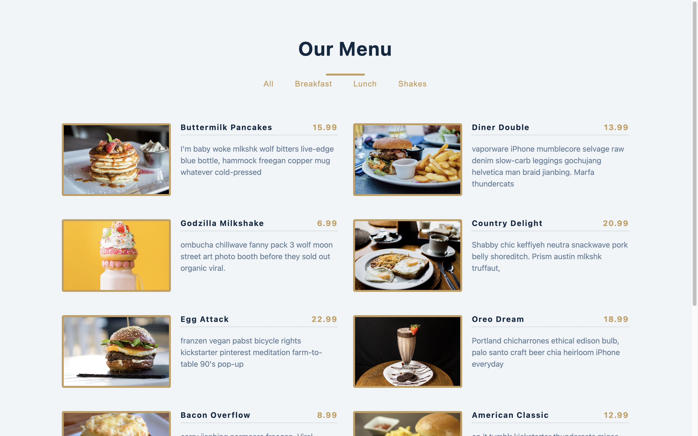
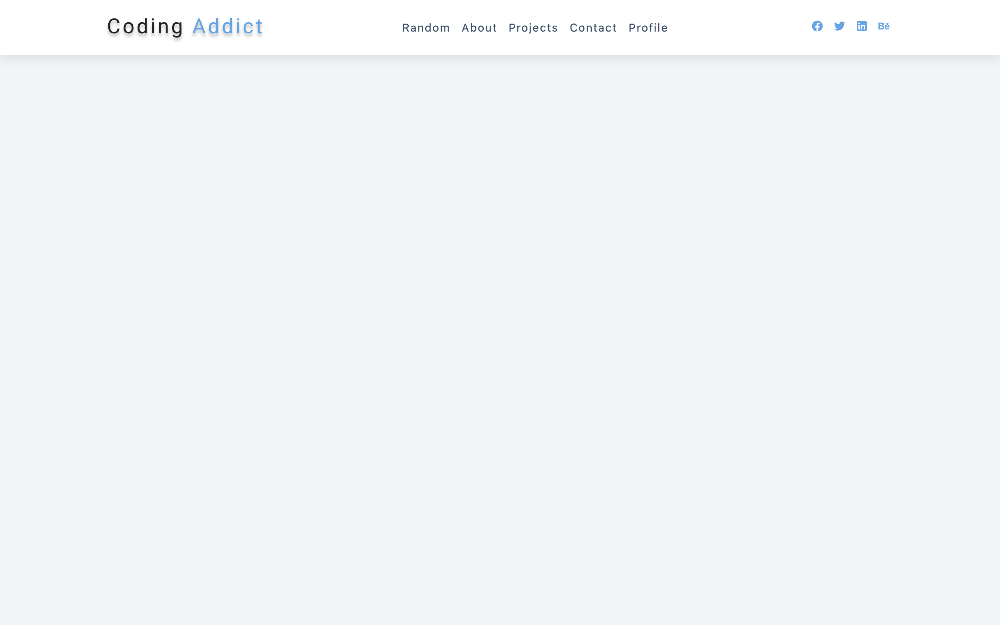
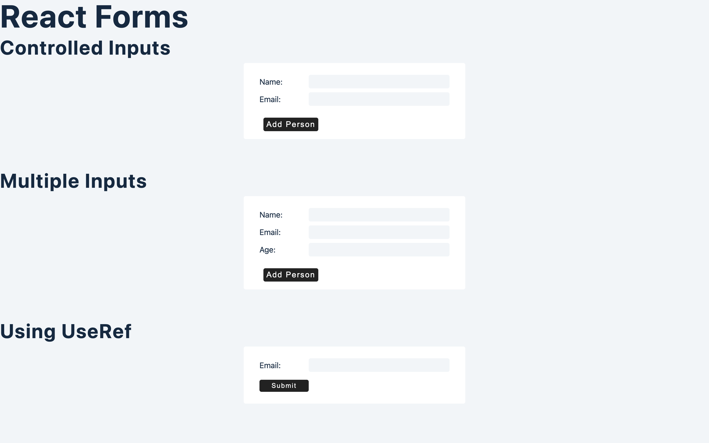

# WDA-React

## All WDA related React Code

### Deployments

#### Topics

##### [🔗 useState Hook](https://wda-react-usestate-hook-mavenranks-projects.vercel.app/)
<!--from Vercel.App-->

##### [🔗 useEffect Hook](https://wda-react-useeffect-hook-mavenranks-projects.vercel.app/)
<!--from Vercel.App-->

##### [🔗 Conditional Rendering](https://wda-react-conditional-rendering.pages.dev/)
<!--from CloudFLare Pages-->

##### [🔗 Forms and useRef](https://wda-react-forms-useref-hook.pages.dev/)
<!--from CloudFlare Pages-->

##### [🔗 useReducer Hook](https://wda-react-usereducer-hook.netlify.app/)
<!-- from Netlify.App -->

##### [🔗 Memo and useMemo, useCallback Hooks](https://wda-react-memo-usememo-usecallback.pages.dev/)

#### Projects

##### [🔗 1-Birthday Reminder](https://wda-react-project-1-birthday-reminder-mavenranks-projects.vercel.app/)
<!--from Vercel.app-->

##### [🔗 3-Reviews Website](https://wda-react-projects-3-reviews.pages.dev/)
<!--from CloudFlare Pages-->

##### [🔗 4-Accordion](https://wda-react-projects-4-accordion.pages.dev/)
<!--from CloudFlare Pages-->

##### [🔗 5-Menu](https://wda-react-projects-5-menu.pages.dev/)
<!--from CloudFlare Pages-->

##### [🔗 6-Tabs (Task - 2)](https://wda-react-task-2-tabs.pages.dev/)
<!-- from CloudFlare Pages -->

##### [🔗 7- Lorem Ipsum Generator](https://wda-react-projects-7-lorem-generator.pages.dev/)
<!-- from CloudFlare Pages -->

##### [🔗 8 - Color Generator](https://wda-react-projects-8-color-generator.pages.dev/)
<!-- from CloudFlare Pages -->

##### [🔗 9 - Grocery Bud (Task - 3)]()

##### [🔗 10 - Navbar](https://wda-react-projects-10-navbar.netlify.app/)
<!-- from Netlify.App -->

##### [🔗 11 - Sidebar and Modal](https://wda-react-projects-11-sidebar-modal.netlify.app/)
<!-- from Netlify.App -->

##### [🔗 12 - Cocktail DB Implementation](https://wda-react-projects-12-cocktails.netlify.app/)
<!-- from Netlify.App -->

##### [🔗 13 - Markdown Preview](https://wda-react-projects-13-markdown.netlify.app/)
<!-- form Netlify.App -->

##### [🔗 14 - Pagination](https://wda-react-projects-14-pagination.netlify.app/)

#### Tasks

##### [🔗 1 - Amazon BestSeller](https://wda-react-task-1-amazon-bestseller.pages.dev/)
<!--from CloudFlare Pages-->

##### [🔗 2 - Tabs Experience](https://wda-react-task-2-tabs.pages.dev/)
<!--from CloudFlare Pages-->

#### Snapshots of Various Websites

