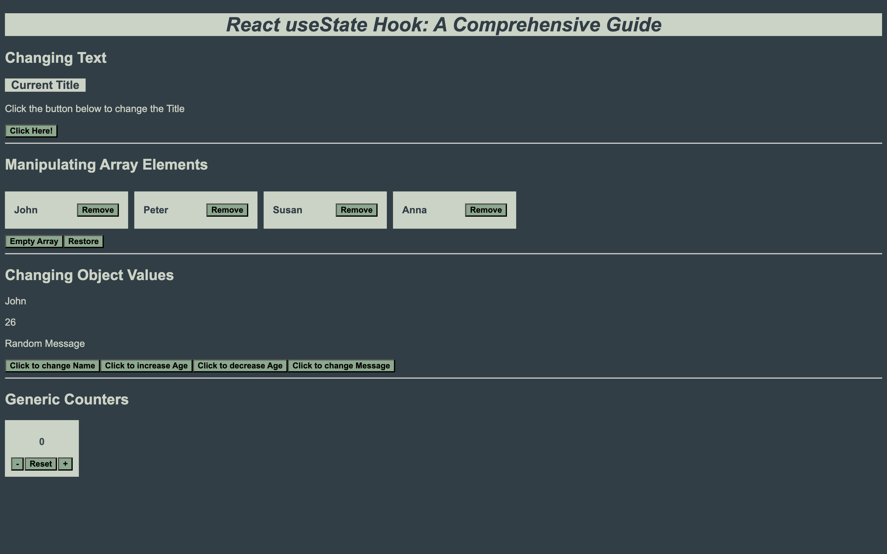

**React useState Hook: A Comprehensive Guide**

This Project demonstrates the basics of the *useState* Hook of ReactJS.

It demonstrates how to manipulate *Text*, *Array Values*, *Object Attributes* and *Creating a Basic Counter* all using the *useState* hook.

